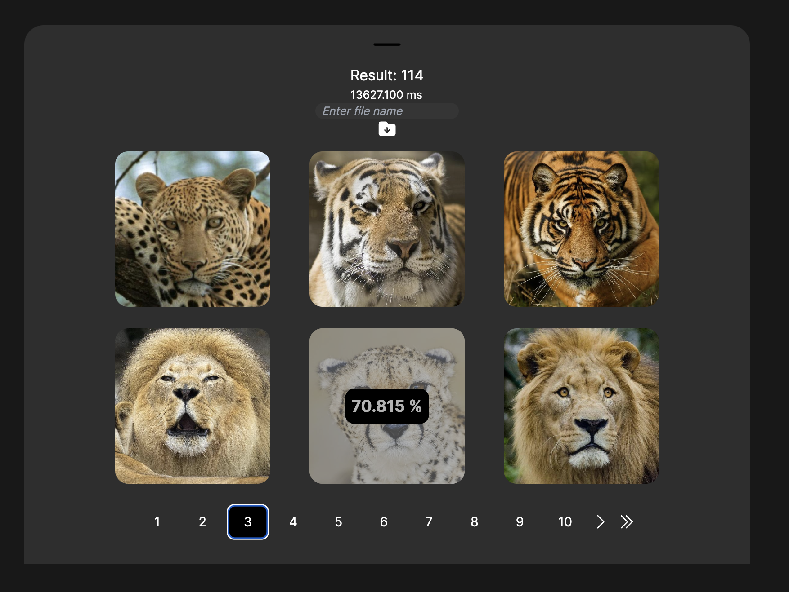
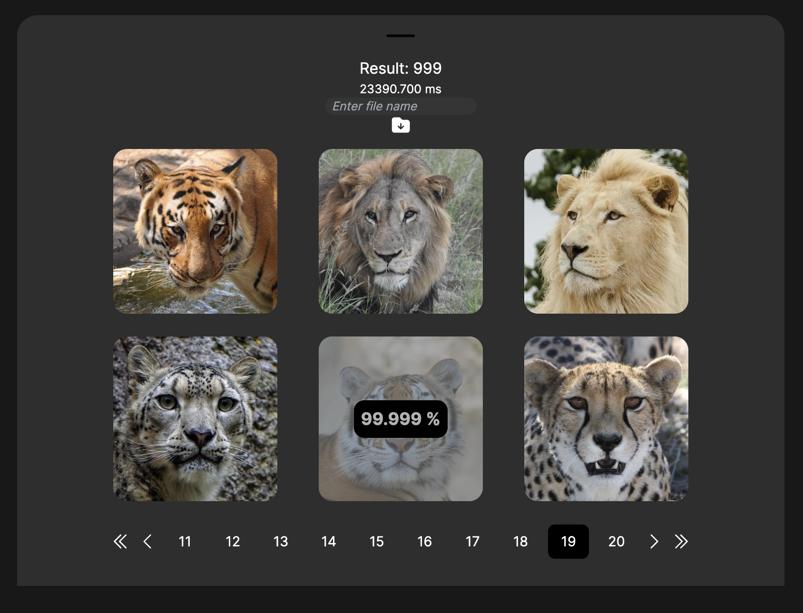

# LookAt

> **Algeo02-22125**

> A website that presents an advanced Content-Based Image Retrieval (CBIR) system using linear algebra principles to analyze and compare images. The platform allows for user-uploaded images and datasets, utilizing mathematical algorithms to process and match images according to similarities in color and texture.


## Table of Contents

- [Technologies Used](#technologies-used)
- [Pre Requirement](#pre-requirement)
- [How To Run](#how-to-run)
- [Screenshots](#screenshots)
- [Contact](#contact)

## Technologies Used

- python
- fastapi
- html
- css
- javascript
- next.js

## Pre Requirement

- python (and pip)
- npm (or yarn)

## How To Run

Run both of the frontend and backend

Then go to [LookAt](http://localhost:3000/)

### Frontend

Go to 'frontend' directory

```bash
cd frontend
```

#### Install Dependencies

Install the required dependencies

```bash
npm install
```

#### Run

```bash
npm run dev
```

### Backend

Go to 'backend' directory

```bash
cd backend
```

#### Setup Virtual Environtmet

Install venv

```bash
pip install venv
```

Create venv

```bash
virtualenv venv
```

Activate venv

```bash
source venv/Scripts/activate  # Windows (bash)
source venv/bin/activate      # WSL / Linux / Mac
```

#### Install Dependencies

Install the required dependencies

```bash
pip install -r requirements.txt
```

#### Run

```bash
python app.py
```

#### Deactivate Virtual Environment

```bash
deactivate
```

## Screenshots

### Color



### Texture



## Contact

Created by

- [@satriadhikara](https://github.com/satriadhikara)
- [@caernations](https://github.com/caernations)
- [@fnathas](https://github.com/fnathas)
